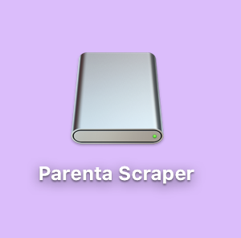
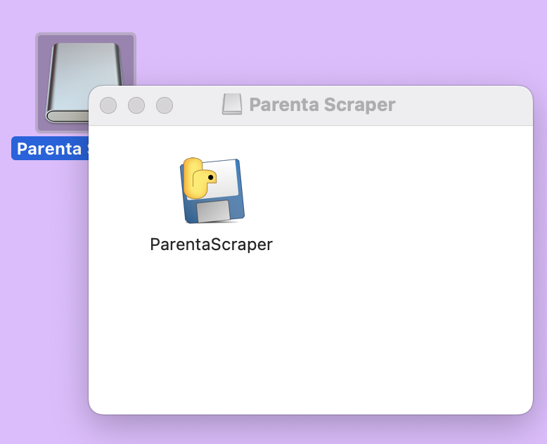
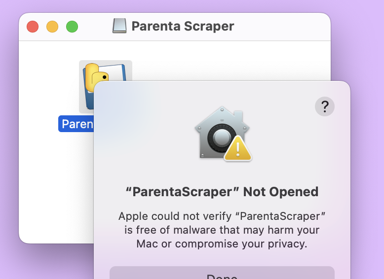
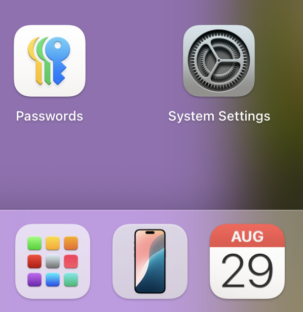
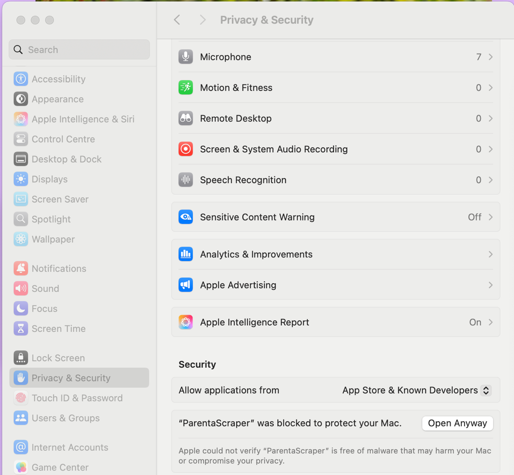
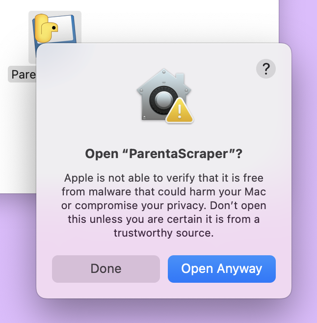

# 📸 Parenta Scraper - Get Your Child's Photos Back!

**Easily download all your child's photos and notes from your Parenta nursery account with one click.**

Perfect for parents who want to save their child's precious memories locally on their computer.

All data is kept within your computer; we do not store any of your data.

## 🚀 Quick Start

### 1. Download for Your Computer
Choose your operating system:

| Windows | macOS | Linux |
|---------|-------|-------|
| [📥 Download Windows](../../releases/latest/download/ParentaScraper-Windows.zip) | [📥 Download Mac](../../releases/latest/download/ParentaScraper-Mac.dmg) | [📥 Download Linux](../../releases/latest/download/ParentaScraper-Linux.tar.gz) |
| Windows 10/11 | macOS 10.15+ | Ubuntu/Fedora/etc |

### 2. Install Google Chrome (Required)
The app uses Chrome to access your nursery account safely.

**Don't have Chrome?** → [Download Chrome here](https://www.google.com/chrome/)

### 3. Run the App
- **Windows**: Extract the ZIP → Double-click `ParentaScraper.exe`
- **Mac**: Open the DMG → Drag to Applications → Run
- **Linux**: Extract the tar.gz → Run `./ParentaScraper`

**Mac specific instructions** 
There is an error which is expected when executing from macOS (unknown developer error). Unfortunately it would take rather long for the full verification process from Apple, plus an additional $99 licensing cost on my end. The quickest way is to bypass this on your own Mac. Please follow the following seven step instructions.

1. Find the downloaded installer (likely on desktop)

2. Double-click on the installer and then double-click the Python app within

3. You will see a security warning. This is expected. Click "Done"

4. Go to "Launchpad" on the dock (the icon with 9 squares and different colors) → then, "System Settings"

5. Click "Privacy and Security" on left panel → then, "Open anyway" for parentascraper

6. Confirm by clicking "Open anyway" in the dialog

7. The app should now launch successfully!  

### 4. Download Your Photos!
1. Enter your Parenta login details
2. Click **"Test (First 50)"** to try it out
3. Click **"Full Scrape"** to download everything

## What It Does

- 📥 **Downloads all photos and videos** from your Parenta account
- 📁 **Saves to your computer** in organized folders
- 📊 **Creates a spreadsheet** with all the activity details
- **Safe and secure** - your login details never leave your computer, all code is open for review

## 📂 Where Are My Photos Saved?

After downloading, find your photos at:
- **Windows**: `C:\Users\[YourName]\Nursery_Downloads_[Mode]\`
- **Mac**: `/Users/[YourName]/Nursery_Downloads_[Mode]/`
- **Linux**: `/home/[YourName]/Nursery_Downloads_[Mode]/`

Plus a CSV file with all the details: `Nursery_Data_[Mode].csv`

## 📂 Requirements

-  **Google Chrome browser** (install first, a must to work)
-  **Internet connection**
-  **Valid Parenta nursery account**
-  **Windows 10+, macOS 10.15+, or modern Linux**

## ❓ FAQs / Troubleshooting

### How long does it take?   
For one child full time with about a years' history about 10 minutes. Can take up to an hour for full scrape of a few years of full time data.

### "Chrome not found" Error
1. Install Google Chrome: https://www.google.com/chrome/
2. Restart the Parenta Scraper app
3. Still having issues? Check the included installation guides

### Login Problems
- Double-check your username and password
- Try logging in at https://parentportal.parenta.com/ first
- Make sure your nursery uses the Parenta system

### App Won't Start
- **Windows**: Right-click � "Run as administrator"
- **Mac**: Right-click � "Open" (bypasses security warning)
- **Linux**: Make sure you have a GUI desktop environment

## Privacy & Security

- **Your data stays private** - nothing is sent to third parties
- **Runs entirely on your computer** - no cloud services
- **Your login details are only used to access Parenta** - never stored permanently
- **Open source** - you can inspect the code yourself

## Found a Problem?

Having issues? We're here to help!

1. **Check the troubleshooting section above**
2. **Read the installation guides** (included with each download)
3. **Report an issue**: [Create an issue on GitHub](../../issues/new)

## For Parents, By Parents

This app was created by a parent who wanted an easy way to download their child's nursery photos. 

**Why we built this:**
- Nursery portals don't offer bulk download; no decomissioning process
- Manually saving hundreds of photos takes hours
- Parents deserve to own their child's memories

## Technical Details

For the technically curious...

- Built with Python and CustomTkinter
- Uses Selenium WebDriver for nursery portal automation
- Parallel downloading for speed
- Cross-platform PyInstaller executables
- Automatic ChromeDriver management
- JavaScript-based data extraction for performance

## 📂 License

This project is open source and provided as is under the MIT License. See [LICENSE](LICENSE) for details.

---

**Made with ❣️ for parents everywhere who want their memories back.**

**Want more automation tools like this?** Check out [davidtang.ai](https://davidtang.ai) for other helpful services.  

If you want to connect with me here's my [LinkedIn](https://www.linkedin.com/in/drdavidtang)

*Not affiliated with Parenta Ltd. This is an independent tool for parents to access their own data.*
